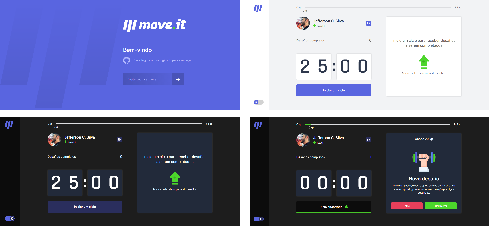

# Move.it

<h2 align="center"> 
  Aplicativo desenvolvido durante Next Level week 04
</h2>

<p align="center">
  
  <a href="https://www.linkedin.com/in/jefferson-c-silva-aa1b7b1a9/">
    
  </a>
  
  <a href="https://www.linkedin.com/in/jefferson-c-silva-aa1b7b1a9/">
    
  </a>
  
  
</p>

<p align="center">
  
</p>

## 💻 Projeto

# Demo

<a href="https://moveit-chi-two.vercel.app">
    
</a>


## 🚀 Tecnologias

- TypeScript
- Next JS
- CSS

## 🔖 Layout

...

## ℹ️ How To Use

```bash
# Clone this repository
$ git clone https://github.com/Jefferson00/Financa.git

# Go into the repository
$ cd moveit

# Install dependencies
$ yarn install

# Run
$ npm run dev
# or
$ yarn dev

```

## 📝 License

Made with ♥ by Jefferson C Silva :wave: [Get in touch!](https://www.linkedin.com/in/jefferson-c-silva)


